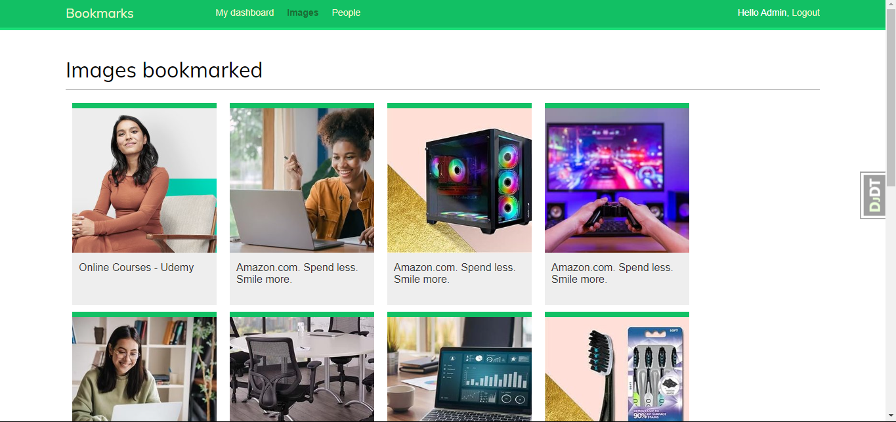
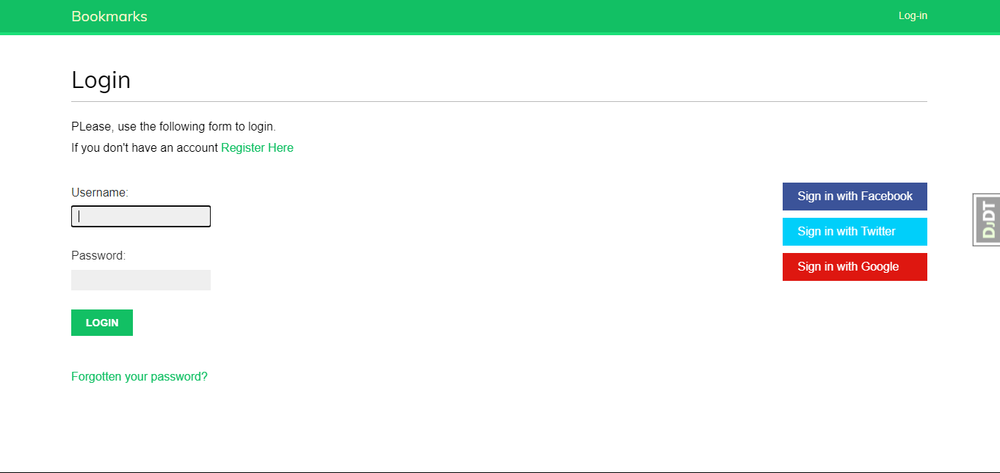
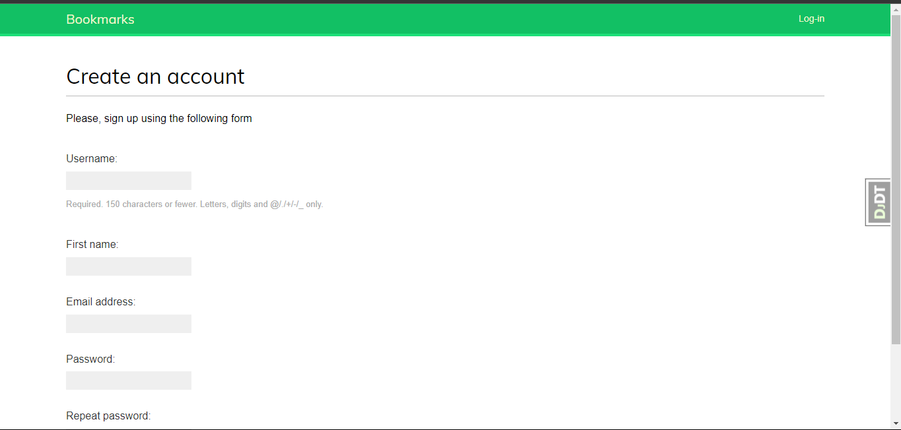
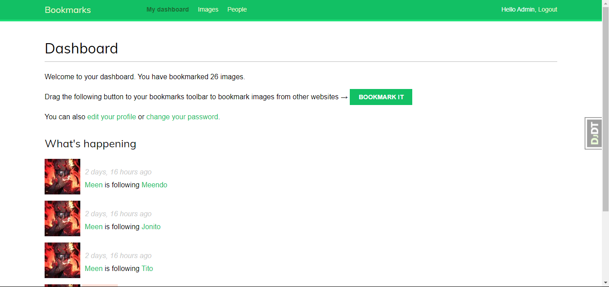

# Project Title: Image Bookmarking and Sharing Website

## Project Description

In this project, I will create a website to bookmark and share images. The website will feature robust authentication using the Django authentication framework and will extend the user model with custom profiles. I'll leverage the Django messages framework for user notifications and build a custom authentication backend.

For social authentication, I'll integrate OAuth2 with Facebook, Twitter, and Google using Python Social Auth. I'll use django-extensions to run the development server through HTTPS and generate image thumbnails with easy-thumbnails. The project will include implementing many-to-many relationships in models.

I will also build a JavaScript bookmarklet to enable users to easily bookmark images directly from their browsers. The site will support asynchronous HTTP requests using the JavaScript Fetch API and Django, and will feature infinite scroll pagination for a seamless user experience.

Additionally, I'll implement a user follow system and create a user activity stream while optimizing QuerySets for performance. I'll learn to use Django signals for decoupled event handling and utilize django-debug-toolbar to obtain relevant debug information.

To enhance the site's functionality, I'll count image views and build an image ranking system using Redis. This project aims to deliver a comprehensive image bookmarking and sharing platform with a rich set of features.




## Table of Contents

- [Project Title: Image Bookmarking and Sharing Website](#project-title-image-bookmarking-and-sharing-website)
  - [Project Description](#project-description)
  - [Table of Contents](#table-of-contents)
  - [Features](#features)
  - [Create a website to bookmark and share images](#create-a-website-to-bookmark-and-share-images)
  - [Installation](#installation)
  - [Screenshots](#screenshots)
  - [Credits](#credits)

## Features
## Create a website to bookmark and share images

- Implement authentication using the [Django authentication framework](https://docs.djangoproject.com/en/stable/topics/auth/)
- Extend the user model with a custom profile model
- Use the [Django messages framework](https://docs.djangoproject.com/en/stable/ref/contrib/messages/)
- Build a custom authentication backend
- Implement social authentication (OAuth2) with Facebook, Twitter, and Google using [Python Social Auth](https://python-social-auth.readthedocs.io/en/latest/)
- Use [django-extensions](https://django-extensions.readthedocs.io/en/latest/) to run the development server through HTTPS
- Generate image thumbnails with [easy-thumbnails](https://easy-thumbnails.readthedocs.io/en/latest/)
- Implement many-to-many relationships in models
- Build a JavaScript bookmarklet with JavaScript and Django
- Add asynchronous HTTP requests with the JavaScript Fetch API and Django
- Implement infinite scroll pagination
- Build a user follow system
- Create a user activity stream and optimize QuerySets
- Learn to use Django signals
- Use [django-debug-toolbar](https://django-debug-toolbar.readthedocs.io/en/latest/) to obtain relevant debug information
- Count image views with [Redis](https://redis.io/)
- Build an image ranking with Redis


## Installation

To install this project, follow these steps:

1. Clone the repository: 
   ```bash
   git clone https://github.com/meenphilip/bookmarks.git
2. Navigate to the project directory: 
    ``` bash 
    cd bookmarks
3. Install the required packages: 
   ```bash
   pipenv install -r requirements.txt
4. Activate the virtual environment:
    ```bash
    pipenv shell
5. Set up the database: 
   ```bash
   python manage.py migrate
6. Create a superuser: 
   ```bash
   python manage.py createsuperuser
7.  Run the development server: 
   ```
   python manage.py runserver 
   ```

## Screenshots




---

## Credits

- **Book Credit**: This project was developed following examples from [Django 4 by Example](https://www.packtpub.com/en-us/product/django-4-by-example-9781801813051) by Antonio Mele.

